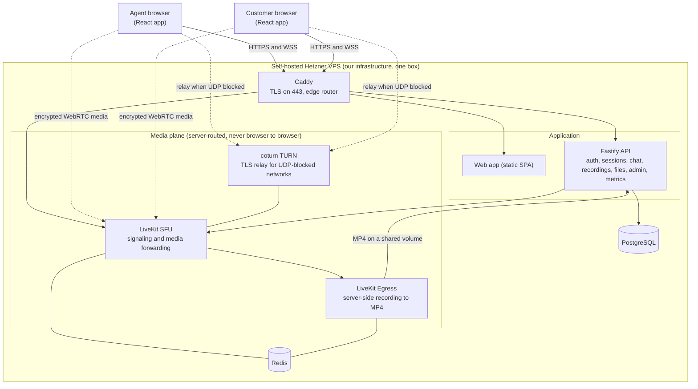

# Atomberg Support

📹 Demo

## Demo

 
https://github.com/user-attachments/assets/0e6422fa-767d-4370-bdfa-d2fbc2370064

A browser based video support desk. A support agent and a customer hold a live audio and video call, with in call chat, file sharing, and call recording, right in the browser with nothing to install.

**Stack:** React browser client · self-hosted LiveKit SFU (WebRTC media) · coturn TURN relay · Caddy edge TLS · PostgreSQL · in-browser recording — all on a single Hetzner VPS.

**Highlights:** fully self-hosted media path (our own SFU and TURN — no Twilio, Agora, Daily, or LiveKit Cloud anywhere in the path), media genuinely server routed through the SFU rather than peer to peer (with runtime proof), and a forced TURN relay over TLS so calls connect even on networks that block UDP.


## This platform is fully self-hosted on our own private VPS

**Every byte of audio and video is routed through our own self-hosted media server on a private Hetzner VPS. We run our own LiveKit SFU (the media router) and our own coturn TURN server (the relay for restrictive networks). There is no third party hosted video service anywhere in the path: no Twilio, no Agora, no Daily, no LiveKit Cloud, no managed WebRTC. The entire stack, signaling, media forwarding, TURN relay, recording, database, and edge TLS, runs on a single box that we operate.**

The media is genuinely server routed, not peer to peer. Both participants send their media to our SFU, and the SFU forwards it to the other side. We include runtime proof of this (see [the proof section](#why-this-is-server-routed-not-peer-to-peer-with-proof) below), including a forced TURN relay over TLS for networks that block UDP.

The use of a self-hosted, open source LiveKit SFU for this submission was approved by the organizers in advance through the official communication channel (the official WhatsApp group).

## Quick start for reviewers

The fastest way to see everything working:

1. Open **https://api.thefoyers.club**
2. Choose to continue as an agent and click the **Demo Agent** card. This signs you in instantly with a real, server issued session (no password). A "Sign in with Microsoft" option sits below it if you prefer single sign on.
3. Click **New support session**. You get a one time invite link.
4. Open that invite link in a second browser, tab, or device. That window is the customer. There is no login; the link itself is the credential.
5. Allow camera and microphone. You are now on a live call. Things to try:
   - talk, and toggle your camera and microphone,
   - open the **chat** panel and send messages,
   - attach a file with the paperclip in chat,
   - press **Record** (agent only), then **Stop**,
   - **Leave** as the customer, or **End session** as the agent.
6. Visit **https://api.thefoyers.club/admin** and sign in as the Demo Agent to see the cross session operations dashboard: live calls, every session, recordings with inline playback, and live metrics.

## Architecture



Everything inside the dashed boundary runs on one private Hetzner VPS that we operate. Browsers connect over HTTPS and secure WebSockets to Caddy, which terminates TLS and routes three things: the static web app, the API (sessions, auth, the chat socket, recordings, files, admin, metrics), and LiveKit signaling.

Real time media never travels browser to browser. Each browser opens an encrypted WebRTC connection to our LiveKit SFU, and the SFU forwards that media to the other participant. When a network blocks UDP, the media falls back to our coturn TURN server over TLS, still on our box. Recording is done server side by LiveKit Egress, which composes both participants into one MP4 on a local volume that the API then serves back, auth gated.

### Why this is server routed, not peer to peer (with proof)

The `proof/` directory holds runtime captures taken from the real system:

- `proof/phase1-localhost-*.json`: two test publishers on one machine. The SFU forwarder logs show each track relayed to the other side, with no direct client to client path.
- `proof/phase2-live-*.json`: a real cross network call to the deployed SFU. The ICE data shows the far end is the client public address, and the server advertises its own public address, which is what a server routed call looks like.
- `proof/phase2-forced-relay-*.json`: a client with UDP blocked (firewalled in a container) still completes the call by relaying through our coturn TURN server over TLS. coturn logs the permission and channel bind and roughly two megabytes relayed in both directions.

## Features

- **Server routed media.** Self-hosted LiveKit SFU, proven across networks, with a forced TURN relay over TLS for UDP-blocked venues.
- **Agent sign in, two ways.** A one click Demo Agent identity (a real server signed session, no password, rate limited) and Microsoft Entra single sign on (authorization code with PKCE). Customers never log in.
- **Signed single session invites.** The agent shares a link, and the link itself is the customer credential. It expires when the session ends.
- **Roles enforced on the server.** Agents get admin, create, and record grants; customers get join only. Every privileged route checks the session and role on the server, not just in the UI.
- **Session lifecycle and history.** A customer can leave while the call continues, and an agent can end the session for everyone. Full participant join and leave history with durations.
- **Live presence.** Present, reconnecting, and left states sourced from the authoritative SFU participant list, with a background reconciliation sweep so nobody is ever stuck in a call.
- **In call chat, backend authoritative.** Messages travel over a WebSocket to our API, which authenticates the sender, validates membership, rate limits, persists, orders, and broadcasts. Bodies are escaped and never rendered as HTML, and history replays on reconnect.
- **Reliability and reconnect.** A network blip shows a non blocking reconnecting indicator and keeps the call on screen; a dropped remote shows reconnecting on their tile; an unrecoverable drop offers a clear rejoin that maps back to the same participant. A presence debounce keeps brief drops from churning the history.
- **Server side recording.** Agent controlled Room Composite recording through LiveKit Egress to a 720p MP4. Both participants see a recording indicator and a consent banner. Recordings play back and download from the agent console and the admin dashboard, auth gated.
- **Secure file sharing.** Send a file to the other side from the chat panel. There is a server side size cap, an extension allowlist plus magic byte content sniffing that rejects executables and scripts, storage of the bytes in the database, and downloads that are auth gated, scoped to the session, and always delivered as a non executable attachment.
- **Admin dashboard and observability.** A cross session operations view at `/admin`, plus request and error counters and live gauges.

## Security

- **Authentication and roles.** Agent sessions are signed JWTs in httpOnly cookies. Customer access is a signed single session invite. Roles map to LiveKit grants and are enforced on the server for every privileged route, not just hidden in the UI.
- **File uploads are treated as untrusted.** A ten megabyte cap. Files are allowed by extension (images, PDF, text, common documents) and then confirmed by magic byte sniffing, with executable and script signatures (ELF, Windows PE, Mach-O, Java class, shell shebang) rejected outright. The client supplied type is never trusted. Downloads require the session cookie or invite, are scoped to that one session, and are served as `application/octet-stream` with `Content-Disposition: attachment` and `X-Content-Type-Options: nosniff`, so a file is never rendered inline and never public.
- **Chat is safe against injection.** Message bodies are stored raw and rendered as text, never as HTML.
- **Secrets are never committed.** Real secrets live only in `infra/.env` on the server, which is gitignored and excluded from every deploy sync. The repository carries only `.env.example` placeholders.

## Run it yourself

You need Docker with Compose v2 and Node.js 22 or newer.

```bash
git clone https://github.com/heynintendo/atomberg-video-support.git
cd atomberg-video-support

# 1. Configure the environment (no real secrets are needed for local use)
cp infra/.env.example infra/.env
# open infra/.env and fill in the values; the file ships with dev friendly
# defaults and notes for each one

# 2. Start the media spine and API (postgres, redis, livekit, egress, api)
docker compose -f infra/docker-compose.yml --env-file infra/.env up -d --build

# 3. Start the web app
npm ci
npm run dev -w @atomquest/web
```

Then open http://localhost:5173. The API runs on http://localhost:8080, and the Vite dev server proxies `/api` to it so the session cookie works on a single origin. The recording volume permission is set up automatically by an `egress-init` step in compose, so recording works on a clean clone with no manual steps.

## Tech stack

- **Frontend:** React, Vite, TypeScript, the LiveKit components and client SDK.
- **Backend:** Node.js 22, Fastify, TypeScript, Prisma with PostgreSQL, the LiveKit server SDK, Redis.
- **Media:** self-hosted LiveKit SFU, self-hosted coturn TURN, LiveKit Egress for recording.
- **Edge and infrastructure:** Caddy for TLS and routing, Docker Compose, a single Hetzner VPS, Cloudflare for DNS.

## Repository layout

```
apps/
  api/      Fastify and TypeScript backend (auth, sessions, chat, recordings, files, admin)
  web/      React, Vite, and TypeScript frontend
packages/
  shared/   Shared TypeScript types (the API contract)
infra/
  docker-compose.yml       local media spine and API
  docker-compose.prod.yml  single box production stack
  caddy/                   edge TLS and routing configuration
  coturn/                  TURN server configuration
  livekit.yaml             SFU configuration
proof/      runtime proof that media is server routed
```
